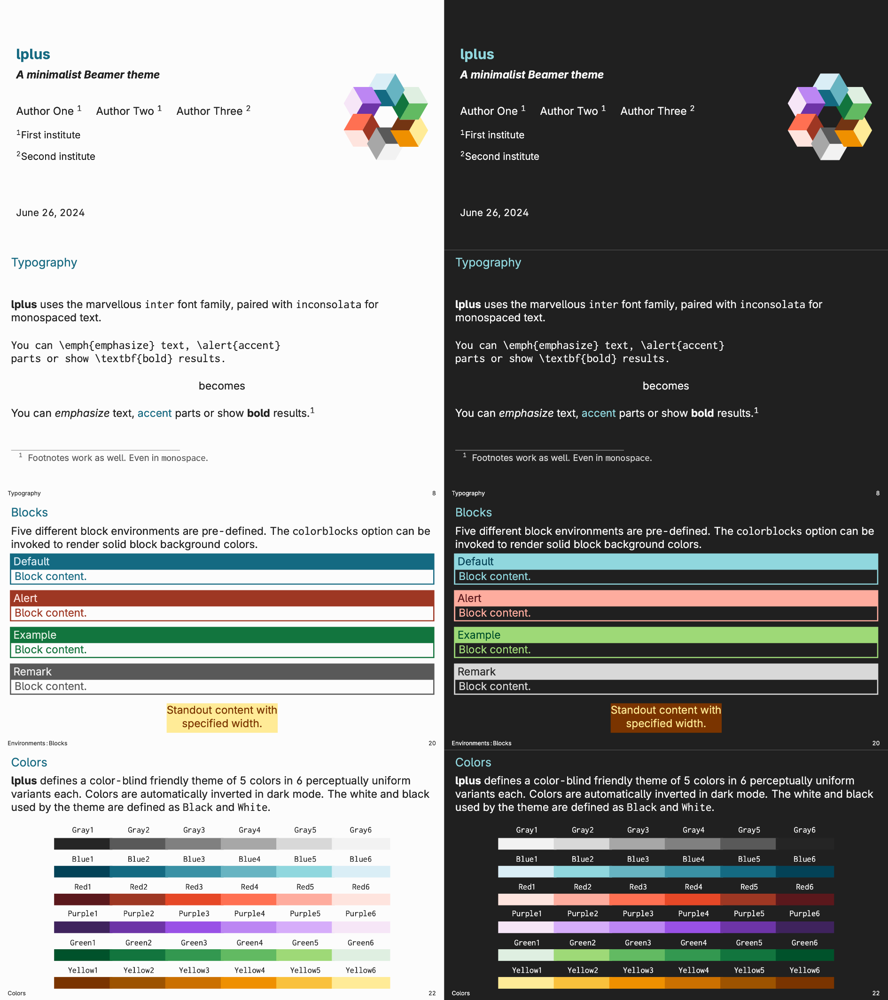

<p align="center">
  
</p>

---

# lplus

`lplus` is a beautiful minimalistic, flexible, fully-featured Beamer theme. It aims for a simplistic, clean look that puts your content first, while providing sensible defaults for all aspects, including a custom color theme and automatic darkmode.




## Installation

Installing `lplus` from source, like any Beamer theme, involves three steps:

1. Download the source with a git clone of the Metropolis repository or as a zip archive of the latest development version.
2. Move the `*.sty` files to the folder containing your presentation. To install `lplus` system-wide, move the `*.sty` files to a folder in your TeX path instead.
3. Use the theme for your presentation by declaring \usetheme{lplus} in the preamble of your Beamer document.

## Usage
The following code snippet shows a minimal working example of using `lplus`:

```latex
\documentclass{beamer}
\usetheme{lplus}
\title{A minimal example}
\date{\today}
\author{Firstname Lastname}
\institute{Institute}

\begin{document}
  \maketitle
  \section{First Section}
  \begin{frame}{First Frame}
    Hello, world!
  \end{frame}
\end{document}
```

For all options and examples, see the [demo slides](assets/demo.pdf).